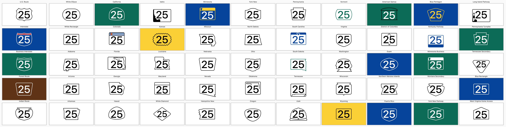

# Rebusurance

Rebusurance is a suite of image assets for displaying [highway shields](https://en.wikipedia.org/wiki/Highway_shield) in software user interfaces. Included in this repository is a single [PaintCode](https://www.paintcodeapp.com/) document that contains various shields for routes in the United States. Each shield is scalable, simultaneously accommodating variations in screen resolution, font size, and route number length. The designs are loosely based on the specifications in the _[Manual on Uniform Traffic Control Devices](https://en.wikipedia.org/wiki/Manual_on_Uniform_Traffic_Control_Devices)_ (MUTCD) as implemented [in Wikimedia Commons template images](https://commons.wikimedia.org/wiki/Category:Highway_shield_templates), including common state and territorial route shields.

This project’s design goals are:

1. Maximize legibility, with the legend set as large as possible and extraneous details removed.
1. Stay within a predictable width and height to facilitate text layout.
1. Resemble the design most commonly seen on signage, preferably guide signs.

The name of this project is a play on the words _[rebus](https://en.wikipedia.org/wiki/Rebus)_ and _reassurance_, as in [reassurance marker](https://en.wikipedia.org/wiki/Reassurance_marker). Just as rebuses are icons displayed inline within a sentence, rebusurance images are best suited for running text, such as within a turn banner or step table in a turn-by-turn navigation application.

## Setup

[PaintCode](https://www.paintcodeapp.com/) is required for opening these image assets. From within PaintCode, choose a target platform and language, then export the assets as a “StyleKit”, which is generated drawing code that you can include in your application. The code that invokes this drawing code can specify the following parameters for any shield:

Name | Kind | Default value | Description
----|----|----|----
`legendText` | String | `25` | The alphanumeric legend born by the shield.
`legendSize` | Number | 60 | The font size of the legend. The shield automatically resizes to fit the legend.

Additionally, each shield accepts two or more color parameters, depending on the colors used by the design. [The default colors](https://commons.wikimedia.org/wiki/Commons:WikiProject_U.S._Roads/Shields) are based on the [MUTCD color specifications](http://mutcd.fhwa.dot.gov/kno-colorspec.htm).

Name | Kind | Default value
----|----|----
`blue` | Color | `#003F87`
`brown` | Color | `#603311`
`green` | Color | `#006B54`
`orange` | Color | `#DD7500`
`pink` | Color | `#EF5B84`
`purple` | Color | `#72166B`
`red` | Color | `#AF1E2D`
`yellow` | Color | `#FCD116`
`yellowGreen` | Color | `#BAD80A`
`white` | Color | `#FFFFFF`
`black` | Color | `#000000`
